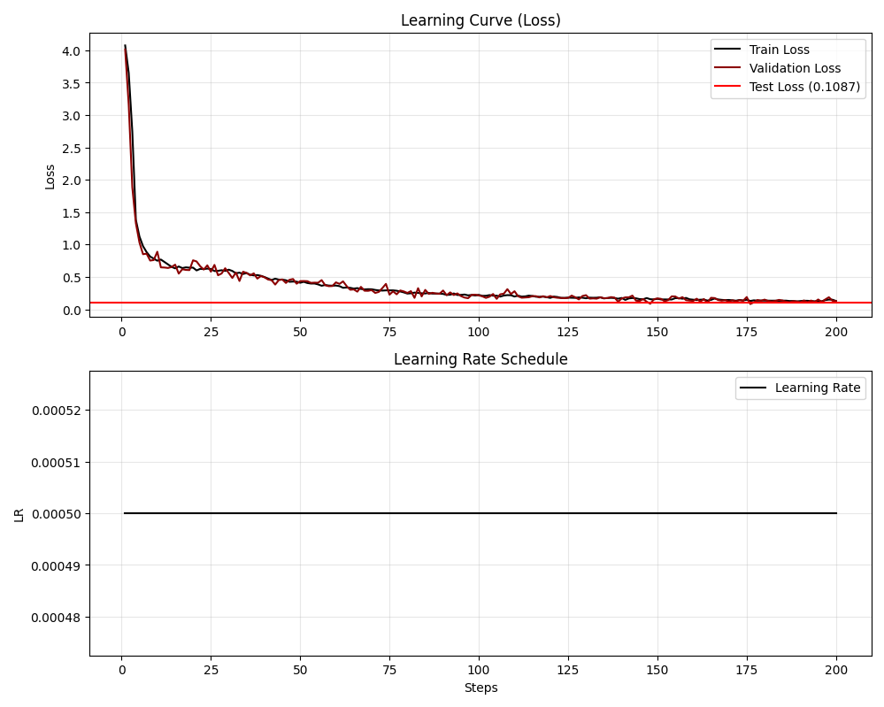
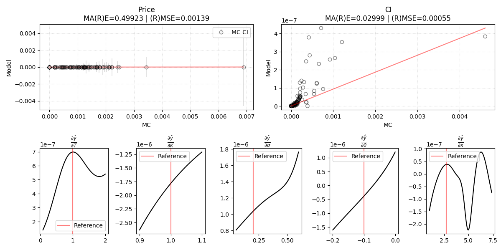

# Monte-Carlo for Variance-Gamma Model and NN Regression

## Introduction

We use CUDA to generate european call option pricings in the VG model with a Monte-Carlo simulation. We then wrote python bindings to use torch to train a model to replicate the MC simulation results using data generated on-the-fly.

Note : Python is also used to plot some vizualizations and run some tests.

## "Quick"-start

We use CUDA and python, you need to have [`uv`](https://docs.astral.sh/uv/getting-started/installation/) and [`nvcc`](https://docs.nvidia.com/cuda/cuda-installation-guide-linux/index.html) installed.

1. Compile the MC cuda code
  
   ```
   cd src/cuda_vg
   nvcc -Xcompiler -fPIC -shared -o vg.so vg.cu random.cu
   cd ../..
   ```

   Note :
  
   - `-fPIC` to use position independent code so the linker won't complain
   - `-shared` to format the output as a library (shared object `.so`)

2. Install the python dependencies in a new virtual environment

   ```
   uv sync
   ```

3. Train and evaluate the model

    ```
    uv run src/main.py
    ```

    Which will run the training loop with a nice progress bar, until `early_stopping` triggers or `max_epoch` is reached, then plot the learning curves and model evaluation. 

### Codebase structure

#### CUDA code

- `src/cuda_vg/random.{cu,cuh}` samples under the gamma and gaussian distribution. **[Q1]**
- `src/cuda_vg/vg.cu` simulates call option prices under the VG model using Monte-Carlo. **[Q2]**


#### Bindings

- `src/cuda_vg/bindings.py`

#### Python code 

- `src/cuda_vg/dataset.py` contains the custom torch `IterableDataset` implementation.
- `src/models.py` contains the model architectures we benchmarked.
- `src/metrics.py` contains the losses we used (We settled on the smooth version of the Huber loss, in log space).
- `src/main.py` contains the torch training loop and some utils. **[Q3]**

### Experiments

- `src/experiments/` contains the plotting functions and some experiments

For instance given the gamma process used in the VG model, we knew we'd encounter low gamma shape parameter values, we ran some KS test to ensure Johnk'algorithm did not encounter precision issues. The code can be found in `experiments/`.

## Results

```Model: ResidualMLP
Learnable parameters : 16098
Hit max epoch : 200                                                                                                                                                                           
Loss : 0.12893 (train) | 0.12825 (val) | 0.10875 (test)
Prior sampling time : 0.68s (0.00000060s/sample)
VG sampling time    : 2.43s (0.00000215s/sample)
MC sampling time    : 0.00000654s/sample
Model sampling time : 0.00002898s/sample
```




